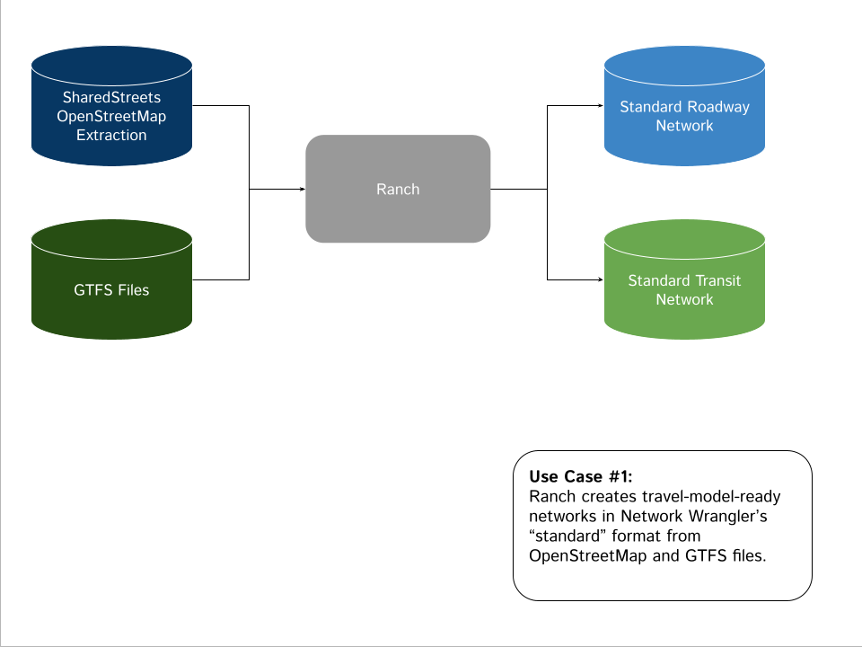
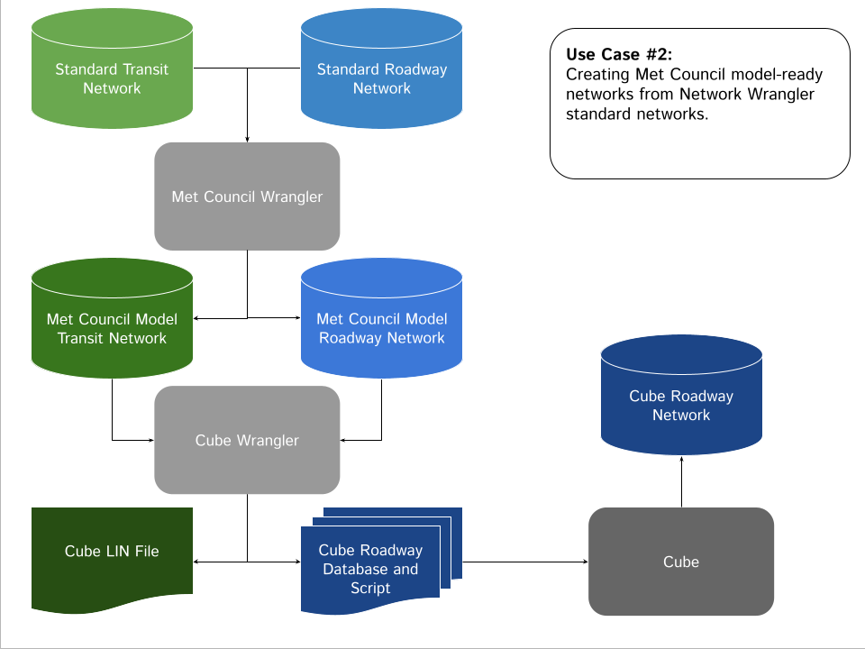
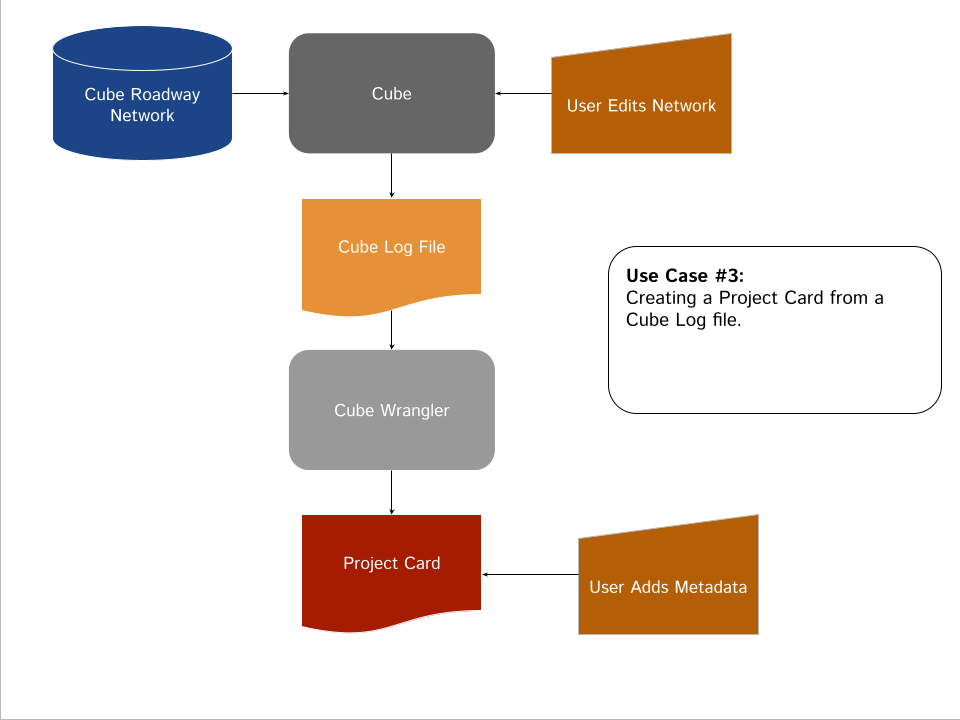
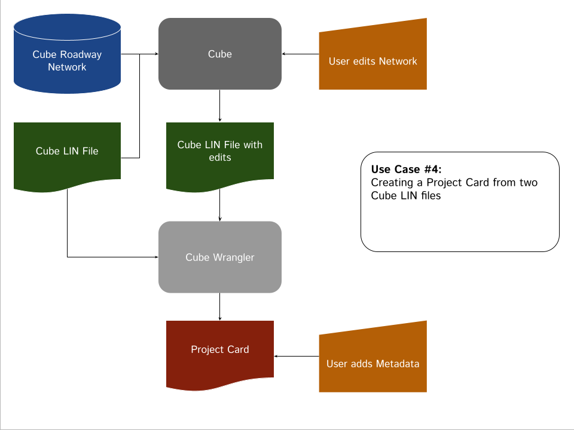
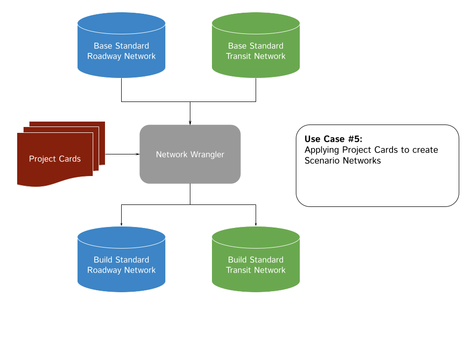

# Met Council Wrangler

Welcome to the Met Council Network Creation and Management site. The Council's network creation and management approach uses the following open source Python packages:

1. [Ranch](https://github.com/wsp-sag/ranch). Ranch creates travel model-ready networks from OpenStreetMap and GTFS feeds. It's key features are as follows:
    * Uses SharedStreets extractions to create a routable network from OpenStreetMap data.
    * Routes GTFS feeds to the OSM-based networks via an algorithm that balances straight-line distances with stop locations. 
    * Creates a travel model-ready representation of the transit network by consolidating routes by patterns. 
    * Creates networks in open formats that are directly compatible with Network Wrangler (see below).
    * Uses an algorithm to automate the creation of centroid connectors. 

2. [Network Wrangler](https://github.com/wsp-sag/network_wrangler). Network Wrangler is a network management and scenario management solution. It has the following key features:
    * Defines network edits in a human- and computer-readable format (see the Project Card specification below). 
    * Allows projects to be coded once (and corrected once) and then applied dozens if not hundreds of times when creating scenarios. 
    * Allows the Council to maintain a single base network and then sequentially apply projects to the base network to create forecast year or scenario networks. 
    * Allows Council staff to code separate projects at the same time (see the Project Card Registry description below for additional details.
    * Allows Council staff to add metadata to project definitions. 
    * Facilitates network auditing, i.e., the software can tell you which projects are in any given scenario network.
    * Allows for the rapid creation of and corrections to dozens of networks.

3. [Project Card](https://github.com/network-wrangler/projectcard). The Project Card repository defines the project card standard, which is a network editing standard. Project Cards are the currency on which Network Wrangler operates. The definition of the schema is defined here as are methods for validating project cards.

4. [Cube Wrangler](https://github.com/network-wrangler/cube_wrangler). The Council's travel demand model uses Bentley's Cube software for network assignment. As such, networks that are created by Ranch and managed via Network Wrangler must, before running the travel model, be converted into Cube format. In addition, the Council primarily uses Cube's network interface to code projects. The key features of Cube Wrangler are as follows:
    * Creates a set of files than can be read in by a Cube script to create a Cube roadway network.
    * Writes out a Network Wrangler transit network in Cube format.  
    * Converts an Cube Log file, which is a record of roadway edits done in Cube, into a project card.
    * Converts two Cube `LIN` files, which are Cube's way of representing transit, int a project card. Note that Cube's log files to not record transit edits. Rather, Cube writes out an updated `LIN` file. Cube Wrangler assesses the differences in the `LIN` files and creates a project card that represents the edits.

5. [Met Council Wrangler](https://github.com/Metropolitan-Council/met_council_wrangler). This reprository is a Python package that assists Met Council in working with the above packages. It has the following key features:
    * Defines parameters, such as the geographic projection, specific to the Council's travel model. 
    * Has methods that create variables needed by the Council's travel model, such as the county in which each roadway link is located. 
    * Combines centroid connectors with the Network Wrangler network to create a travel model ready representation. 
    * Has other utilities that assist with network creation and/or management. 

6. [Project Card Registry](https://github.com/Metropolitan-Council/project_card_registry). When coding projects in Cube against a base network that require creating a new node, Cube will use the next available node number. If two users are coding projects at the same time, the result will be project cards for separate projects that add the same node number to the base network. The Project Card Registry is a web-based database that automates the reconcillation of this conflict. Users can upload project cards after coding projects to the Registry. Python code will then update the numbers for new nodes if they are already in the Registry (and therefore already assigned to new projects). The Registry is also an excellent place to store, share, and manage project cards. 

## Installation
[NOT YET IMPLEMENTED]

The Met Council Wrangler package is available on PyPI. If you are managing multiple python versions, we suggest using [`virtualenv`](https://virtualenv.pypa.io/en/latest/) or [`conda`](https://conda.io/en/latest/) virtual environments. `conda` is the environment manager that is contained within both the Anaconda and mini-conda applications.

An example instalion using conda in the command line is as follows:

```bash
conda config --add channels conda-forge
conda create python=3.10 rtree geopandas osmnx -n <your_environment_name>
conda activate <your_environment_name>
pip install met_council_wrangler
```

Installing the Met Council Wrangler package will also install the following packages:

* Network Wrangler
* Project Card
* Cube Wrangler
* Plus numerous other packages that are dependencies of the above packages.

## Typical Usage
The following flowcharts and Jupyter notebooks illustrate typical uses cases of the Council's network tools.

### Typical Use #1: Network Creation


[NOTEBOOK or CODE SNIPPET TO BE ADDED]

### Typical Use #2: Creating a Cube Network


[NOTEBOOK or CODE SNIPPET TO BE ADDED]

### Typical Use #3: Creating a Project Card from a Cube Log File


[NOTEBOOK or CODE SNIPPET TO BE ADDED]

### Typical Use #4: Creating a Project Card from Two Cube LIN Files


[NOTEBOOK or CODE SNIPPET TO BE ADDED]

### Typical Use #5: Applying Project Cards to create a Scenario Network


[NOTEBOOK or CODE SNIPPET TO BE ADDED]


